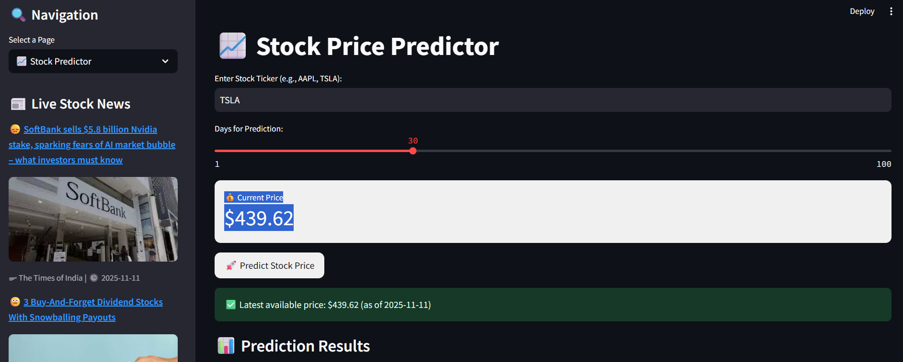
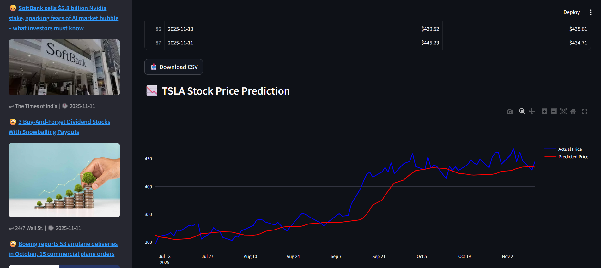
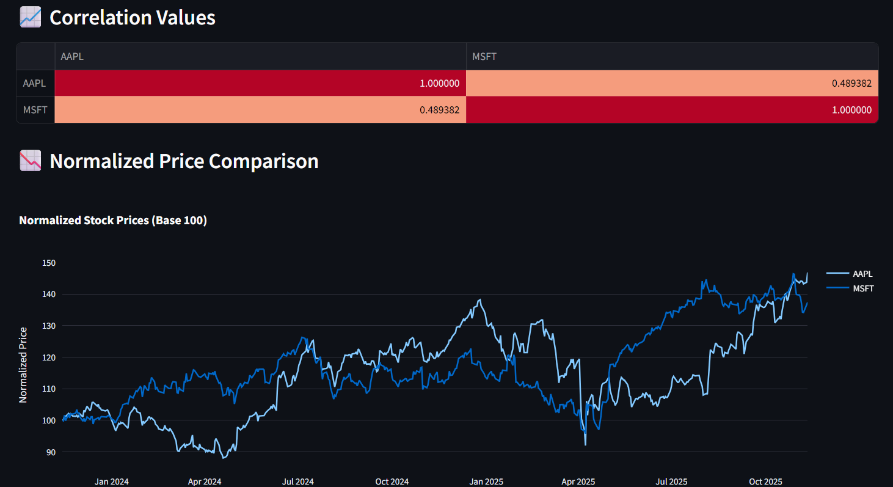
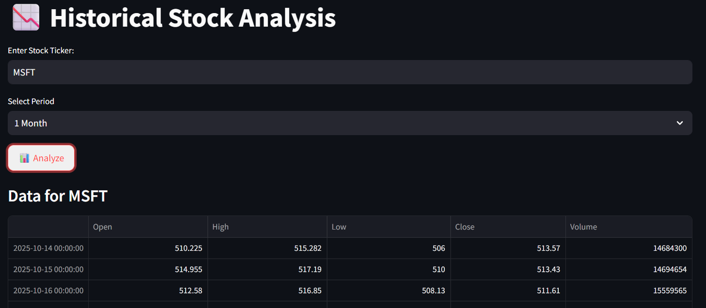
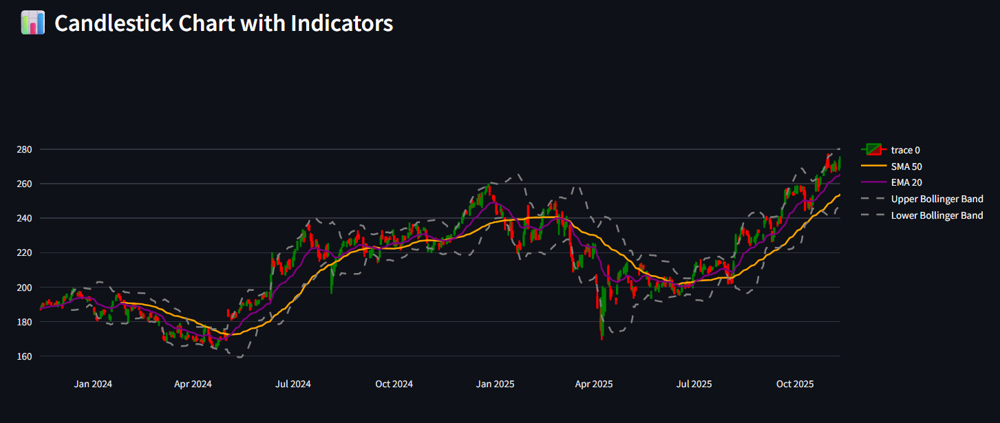

# 📈 Stock Analysis and Prediction Web App

This project is a **Flask-based multi-page web application** that provides:
- **LSTM-based Stock Price Prediction**
- **Historical Stock Data Analysis with Technical Indicators**
- **Stock Correlation Analysis between Multiple Tickers**

All modules use **Alpha Vantage API** for fetching financial data and are organized using **Flask Blueprints** for modular structure.

---

## 🚀 Features

### 🔮 1. Stock Price Prediction (LSTM Model)
- Predicts future stock prices using **LSTM (Long Short-Term Memory)** neural networks.
- Fetches up to 2 years of daily stock data from Alpha Vantage.
- Supports predictions for **1–365 future days**.
- Displays:
  - Historical vs. predicted prices
  - RMSE & MAE performance metrics
  - Future forecasted trend

### 📊 2. Historical Data Analysis
- Fetches historical daily stock data.
- Allows selection of different **time periods** (1 month to 10 years or max).
- Displays:
  - **SMA20**, **SMA50**, **EMA20**
  - **RSI (Relative Strength Index)**
  - **Bollinger Bands**
  - Daily Returns and Volatility
- Shows summary statistics such as:
  - Current Price, High, Low, Average Volume, Total Return, etc.

### 🔗 3. Correlation Analysis
- Compare correlations between **multiple stock tickers** (up to 10 at once).
- Generates a **correlation matrix** and identifies **top correlated pairs**.
- Displays key statistics for each ticker:
  - Current Price
  - % Price Change
  - Volatility
  - Mean Price

---

## 📸 Implementation Screenshots

### Stock-Predictor


### Stock-Prediction & Stock-News


### Stock-Correlation-Heatmap


### Correlation-Price-Normalization


### Historical-Price-Analysis


### Candlestick-Chart


---

## 🧠 Tech Stack

| Component | Technology |
|------------|-------------|
| Backend | Flask (Python) |
| Machine Learning | TensorFlow / Keras (LSTM) |
| Data Handling | Pandas, NumPy |
| Visualization | HTML + Chart.js (in templates) |
| API | Alpha Vantage |
| Caching | functools.lru_cache |
| HTTP Requests | requests |
| Frontend | HTML + CSS (Jinja2 templates) |

---

## 🗂️ Project Structure

```
project-root/
│
├── app.py                    # Main Flask app (entry point)
├── predictor.py              # LSTM stock price prediction blueprint
├── historical.py             # Historical data analysis blueprint
├── correlation.py            # Correlation analysis blueprint
│
├── templates/
│   ├── home.html             # Prediction page
│   ├── historical.html       # Historical analysis page
│   └── correlation.html      # Correlation analysis page
│
├── static/
│   ├── css/
│   ├── js/
│   └── images/
│
├── images/
│   ├── app_overview.png
│   ├── predictor_output.png
│   ├── predictor_chart.png
│   ├── historical_analysis.png
│   ├── correlation_heatmap.png
│   └── correlation_normalized.png
└── README.md                 # Project documentation
```

---

## ⚙️ Installation and Setup

### 1. Clone the repository
```bash
git clone https://github.com/yourusername/stock-analysis-flask.git
cd stock-analysis-flask
```

### 2. Create and activate a virtual environment
```bash
python -m venv venv
venv\Scripts\activate   # On Windows
source venv/bin/activate  # On macOS/Linux
```

### 3. Install dependencies
```bash
pip install -r requirements.txt
```

If `requirements.txt` doesn’t exist yet, here are the key packages:
```bash
pip install flask tensorflow pandas numpy scikit-learn requests
```

### 4. Add your Alpha Vantage API key
Replace this line in all scripts (`predictor.py`, `historical.py`, `correlation.py`):
```python
ALPHA_VANTAGE_API_KEY = "UV0H8FN0FJWS5WVK"
```
with your own API key (get one for free at https://www.alphavantage.co/support/#api-key).

### 5. Run the app
```bash
python app.py
```

Access it at:
```
http://127.0.0.1:5000/
```

---

## 🧩 Routes Overview

| Route | Description |
|-------|-------------|
| `/` | Home page with LSTM prediction form |
| `/predict` | LSTM stock price prediction (POST request) |
| `/historical` | Historical stock analysis |
| `/correlation` | Multi-ticker correlation analysis |

---

## ⚠️ Notes
- **Alpha Vantage API Limitations:**
  - Free tier: 5 requests/minute, 25 requests/day.
  - The app uses caching (lru_cache) and rate limiting (time.sleep) to avoid hitting limits.
- Ensure **stable internet connection** for API calls.
- Model retrains on each prediction (simple demonstration purpose).

---

## 📘 Example Use

1. Navigate to `/predict`
2. Enter ticker symbol (e.g., `AAPL`) and number of days (e.g., `30`)
3. Click “Predict” to generate:
   - LSTM predicted trend
   - Actual vs predicted graph
   - Error metrics

4. For `/historical`, choose `MSFT`, `1y`, and interval `1wk` to view technical analysis.

5. For `/correlation`, enter multiple tickers like:
   ```
   AAPL, MSFT, TSLA, AMZN
   ```
   to see correlation results.

---

## 📄 License
This project is licensed under the MIT License.


---

# 🌐 Streamlit Version: `stock_predictor.py`

This Streamlit-based version combines **Stock Prediction**, **Historical Analysis**, and **Correlation Dashboard** into a single interactive web application.

## 🧩 Features Overview

### 📈 1. Stock Predictor
- Uses **LSTM neural network** to predict stock prices.
- Fetches stock data from **Alpha Vantage API**.
- Integrates **VADER Sentiment Analysis** to analyze stock-related news.
- Displays:
  - Current and historical prices
  - Prediction vs Actual comparison
  - Future predictions for selected days
  - Technical charts (SMA, EMA, Bollinger Bands, Candlesticks)

### 📉 2. Historical Analysis
- Displays past stock performance.
- Supports multiple time ranges (1 month to full history).
- Plots:
  - Price trends
  - Moving averages (SMA20, SMA50)
  - Volume charts

### 📊 3. Stock Correlation Dashboard
- Compares multiple stocks (up to 10) using correlation analysis.
- Generates a **heatmap** using Seaborn.
- Normalized price comparison chart for trend analysis.

---

## ⚙️ Setup Instructions for Streamlit App

### 1. Install dependencies
```bash
pip install streamlit tensorflow pandas numpy scikit-learn requests plotly beautifulsoup4 matplotlib seaborn vaderSentiment
```

### 2. Run the app
```bash
streamlit run stock_predictor.py
```

### 3. Access locally
Once launched, open your browser and go to:
```
http://localhost:8501
```

---

## 🗂️ File Overview

| File | Description |
|------|--------------|
| `stock_predictor.py` | Streamlit-based stock predictor, analyzer, and correlation dashboard |
| `app.py` | Flask entry point (multi-page backend app) |
| `predictor.py` | LSTM-based stock prediction module |
| `historical.py` | Historical stock analysis module |
| `correlation.py` | Stock correlation analysis module |

---

## 🧠 Additional Features

- **Caching** (`@st.cache_data`) to reduce API requests
- **Live News Feed** integrated with News API
- **Interactive Charts** using Plotly and Matplotlib
- **Error Handling & API Rate Management**
- **Downloadable CSV Reports** for predictions

---

## 🔑 API Keys
You need valid API keys for both Alpha Vantage and News API.

Replace inside `stock_predictor.py`:
```python
ALPHA_VANTAGE_API_KEY = "your-alpha-vantage-key"
NEWS_API_KEY = "your-news-api-key"
```

- Get your free keys from:
  - [Alpha Vantage](https://www.alphavantage.co/support/#api-key)
  - [News API](https://newsapi.org/register)

---

## 🧾 Example Usage

1. Launch the Streamlit app using:
   ```bash
   streamlit run stock_predictor.py
   ```

2. Select the desired page from the sidebar:
   - 📈 Stock Predictor → Predict future prices
   - 📉 Historical Analysis → Analyze past performance
   - 📊 Correlation Dashboard → Compare multiple stocks

3. Enter valid tickers (e.g., AAPL, MSFT, TSLA) and view dynamic insights instantly.

---

## 📄 License
This project is licensed under the MIT License.
