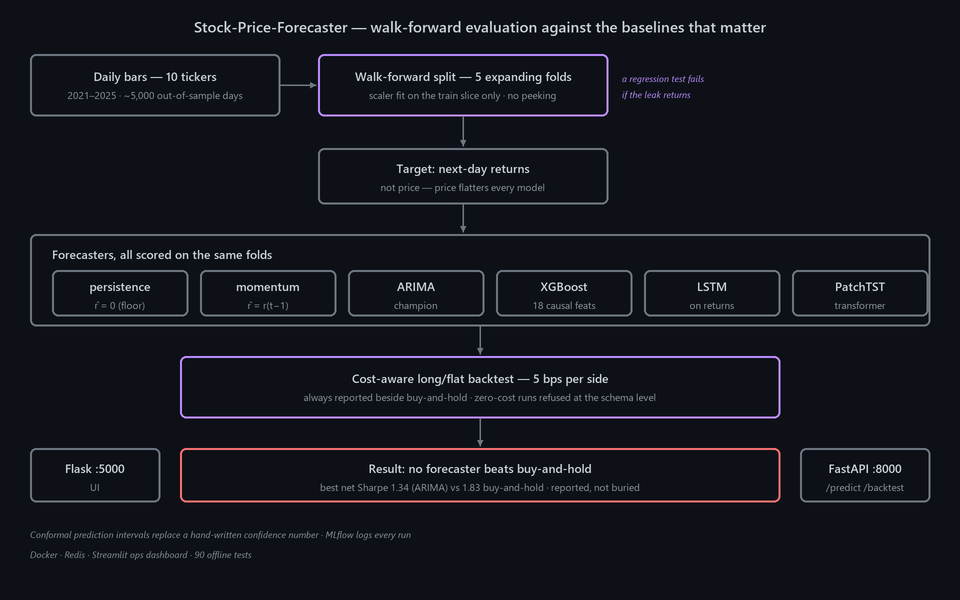

> 🔗 **Live demo:** https://iambatman07-stock-price-forecaster.hf.space · [HF Space](https://huggingface.co/spaces/IamBatman07/Stock-Price-Forecaster)
>
> ⚡ **60-second local demo:** `python demo.py` (offline, ~8s)

# Stock-Price-Forecaster

A stock-forecasting app that is built to answer one question honestly: does any of this actually make money? It trains six forecasters — ARIMA, XGBoost, an LSTM, a PatchTST transformer, momentum and a persistence floor — on next-day returns for ten large-cap tickers, scores them walk-forward across five expanding folds so nothing peeks at the future, and runs every prediction through a cost-aware long/flat backtest that always reports buy-and-hold beside the strategy.

**The answer is no, and this README says so.** The best forecaster in the repo loses to simply holding the stock. Everything below is the measurement that shows it.

---

## Architecture



---

## Measured results

Ten tickers (AAPL MSFT SPY GOOGL AMZN META NVDA JPM XOM KO), 2021–2025, ~5,000 out-of-sample days, 5 bps per side. Sharpe and return are means across the ten.

| Strategy | Net Sharpe | Mean total return |
|---|---:|---:|
| **Buy-and-hold** | **1.830** | **+178.7%** |
| always-up (bet up daily) | 1.830 | +178.7% |
| ARIMA (best forecaster) | 1.340 | +118.1% |
| XGBoost (18 causal features) | 1.220 | +84.1% |
| LSTM on returns | 1.108 | +79.6% |
| momentum | 0.904 | +54.6% |
| Prophet | 0.875 | +75.2% |
| persistence (r̂ = 0) | 0.000 | 0.0% |

Source: [`results/phase2b_trading.csv`](results/phase2b_trading.csv) — per-ticker rows, aggregated here.

**No strategy beats buy-and-hold.** The best forecaster gives up 0.49 Sharpe against doing nothing.

### The forecasts are barely better than predicting zero

| Method | Mean RMSE (returns) | Directional accuracy |
|---|---:|---:|
| persistence (r̂ = 0) | **0.016380** | — takes no position |
| LSTM on returns | 0.016395 | 0.5193 |
| momentum | 0.023088 | 0.5114 |
| LSTM on price | 0.030677 | 0.4894 |

Predicting a flat zero beats every model on RMSE. Source: [`results/phase2a_walkforward_summary.csv`](results/phase2a_walkforward_summary.csv)

### The leakage fix, quantified

The original code fit the scaler on the full price series before splitting, leaking the test window's min/max into training and understating reported error:

| | Leaky scaler | Honest scaler |
|---|---:|---:|
| AAPL price-RMSE | 5.285 | 6.504 (**+23.1%**) |
| Mean across 10 tickers | — | **+5.2%** reported-error inflation |
| LSTM beats persistence on RMSE | — | **0 of 10 tickers** |

Source: [`results/phase1_leakage_comparison.csv`](results/phase1_leakage_comparison.csv)

### A frontier LLM is a coin flip

Asked for next-day direction on 200 anonymized samples — no ticker, no dates:

| | Value |
|---|---:|
| Correct calls | **100 / 200** |
| Directional accuracy | **0.500** |
| 95% CI | [0.431, 0.569] |
| p vs a fair coin | **1.0** |

It called "up" 77% of the time against a 53% base rate. Source: [`results/metrics.json`](results/metrics.json) (`day08`)

### Portfolio construction doesn't rescue it

24 portfolio configurations (signal × weighting scheme × stop-loss × cost):

- **22 of 24 lose to equal-weight buy-and-hold** on Sharpe.
- The best config beats it by just +0.215 Sharpe.

Source: [`results/phase5_portfolio.csv`](results/phase5_portfolio.csv)

---

## How it works

1. **Load** daily bars for ten tickers, 2021–2025.
2. **Split walk-forward** into five expanding folds. The scaler is fit on the train slice only — a regression test fails if the full-series fit ever returns.
3. **Predict next-day returns**, not price. Price targets flatter every model, because yesterday's price is nearly today's.
4. **Score** each forecaster on identical folds against two baselines: persistence (predict zero) and always-up.
5. **Backtest** long/flat with 5 bps per side. `/backtest` refuses zero-cost runs at the schema level and always returns buy-and-hold alongside the strategy, so a flattering comparison cannot be requested.
6. **Quantify uncertainty** with conformal prediction intervals, replacing a hand-written confidence number.
7. **Report** the result even though it is negative.

## Infrastructure

| Layer | Technology |
|---|---|
| Models | statsmodels (ARIMA) · XGBoost · TensorFlow (LSTM) · PatchTST · Prophet |
| Tuning | Optuna |
| Evaluation | custom walk-forward harness · conformal intervals |
| API | FastAPI — `/predict` `/backtest` `/indicators` `/correlation` |
| UI | Flask (:5000) · Streamlit ops dashboard |
| Tracking | MLflow |
| Cache | Redis |
| Packaging | Docker Compose |
| Tests | 90, all offline |

---

## Run it

```bash
pip install -r requirements.txt

python demo.py                                # offline demo
pytest tests -q                               # test suite
python app.py                                 # Flask UI on :5000
uvicorn src.serving.api:app --port 8000       # API on :8000
streamlit run src/serving/dashboard.py        # ops dashboard
docker compose up                             # API + Redis + MLflow + dashboard
```

```bash
curl -s -X POST localhost:8000/backtest -H "Content-Type: application/json" \
  -d '{"ticker": "AAPL", "model": "arima", "cost_bps": 5}'
```

Regenerate the architecture diagram with `python assets/make_architecture.py`.

---

## Limitations

Survivorship-biased ticker universe (all survivors); US large-cap daily bars only; long/flat execution (no shorting, slippage modelled as a flat bps charge); interval coverage assumes exchangeable errors.

**Nothing in this repo is investment advice — its own measurements argue against using it as any.**

---

## License

MIT — see [LICENSE](LICENSE).
